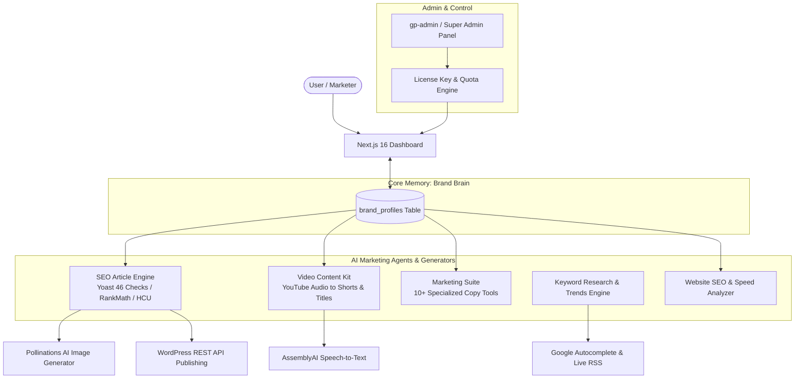

# GrowthPilot AI (SEO Automation) - Complete Project Documentation & Feature Review

---

## ১. প্রজেক্টের সংক্ষিপ্ত পরিচিতি (Project Overview & Identity)

**GrowthPilot AI** (ইন্টারনাল কোডবেস: `SEO Automation`) হলো একটি ফুল-স্ট্যাক **Virtual AI Marketing Team & SaaS Automation Workspace**। 

এটি মূলত সাধারণ কোনো চ্যাটবট বা টেক্সট জেনারেটর নয়; এটি এমন একটি প্ল্যাটফর্ম যা একটি স্বয়ংক্রিয় ডিজিটাল মার্কেটিং এজেন্সির মতো বিভিন্ন স্পেশালাইজড রোল (SEO Specialist, Senior Copywriter, Social Media Manager, Video Producer, Web Publisher, Website Auditor) স্বয়ংক্রিয়ভাবে পালন করে।

### টার্গেট অডিয়েন্স:
- **F-Commerce (Facebook Commerce) ও অনলাইন উদ্যোক্তা:** যারা নিয়মিত রেলিভেন্ট কনটেন্ট, বাংলা/বাংলিশ ক্যাপশন, প্রোডাক্ট ডেসক্রিপশন, অ্যাড কপি এবং আকর্ষণীয় অফার তৈরি করতে চান।
- **SMEs ও স্টার্টআপ:** যাদের বড় মার্কেটিং এজেন্সির বাজেট নেই, কিন্তু হাই-কোয়ালিটি এসইও আর্টিকেল, ওয়েবসাইট অডিট এবং ক্যাম্পেইন প্ল্যান প্রয়োজন।
- **B2C ব্র্যান্ড ও কনটেন্ট ক্রিয়েটর:** যারা ইউটিউব বা ভিডিও কনটেন্টকে সহজে রিলস, শর্টস, সোশ্যাল পোস্ট ও ব্লগে রূপান্তর করতে চান।
- **B2B ও এজেন্সি:** যাদের ব্র্যান্ডের নির্দিষ্ট ভয়েস ও গাইডলাইন বজায় রেখে স্কেলে কনটেন্ট তৈরি করা প্রয়োজন।

---

## ২. কোর টেকনোলজি স্ট্যাক (Tech Stack & Architecture)

| Component | Technologies Used | Details / Functionality |
| :--- | :--- | :--- |
| **Frontend Framework** | **Next.js 16 (App Router)** | React 19, Server & Client Components, Dynamic Routing |
| **Styling & UI** | **Tailwind CSS, Lucide Icons, Framer Motion** | ফুললি রেসপনসিভ ডার্ক/লাইট মোড, আধুনিক ড্যাশবোর্ড ইন্টারফেস |
| **Database & Auth** | **Supabase (PostgreSQL)** | Row Level Security (RLS), Supabase Auth, User Management |
| **AI Engine (LLMs)** | **Google Gemini & OpenRouter API** | Gemini 2.5/Gemini Pro, Claude, GPT মডেলের সমন্বয়ে হাইব্রিড ফলব্যাক |
| **Image Generation** | **Pollinations AI** | প্রতিটি আর্টিকেলের `alt` ডেসক্রিপশন থেকে ইনস্ট্যান্ট ডায়নামিক হাই-কোয়ালিটি ইমেজ তৈরি |
| **Video & Audio AI** | **AssemblyAI & @distube/ytdl-core** | ইউটিউব অডিও স্ট্রিম এক্সট্রাকশন ও স্পিচ-টু-টেক্সট ট্রান্সক্রিপশন |
| **Publishing CMS** | **WordPress REST API** | সরাসরি ওয়ান-ক্লিকে ওয়ার্ডপ্রেস ওয়েবসাইটে ড্রাফট বা পাবলিশ |
| **Trends & Buzz** | **RSS Parser & Google Trends** | রিয়েল-টাইম গুগল ট্রেন্ডস ও সোশ্যাল মিডিয়া বাজ (Reddit, Twitter, YouTube, LinkedIn) |
| **Payment Gateway** | **Custom Gateway UI (Card, bKash, Nagad)** | লাইসেন্স কি অ্যাক্টিভেশন এবং মাল্টি-স্টেপ চেকআউট ইন্টারফেস |

---

## ৩. আর্কিটেকচারাল ডায়াগ্রাম (System Architecture)



---

## ৪. সকল ফিচারের বিস্তারিত বিবরণ (Detailed Feature Breakdown)

### ক. ব্র্যান্ড ব্রেন (Brand Brain - `/dashboard/brand`)
* **উদ্দেশ্য:** এটি হলো প্ল্যাটফর্মের কেন্দ্রীয় মেমোরি। সাধারণ জেনেরিক AI টুল কোম্পানির তথ্য মনে রাখে না; কিন্তু Brand Brain কোম্পানির ডিটেইলস স্থায়ীভাবে মনে রাখে।
* **যেসব তথ্য ইনপুট দেওয়া যায়:**
  - ব্যবসার নাম, ইন্ডাস্ট্রি, ওয়েবসাইটের URL, লোকেশন/টার্গেট মার্কেট (যেমন: Bangladesh, Global)।
  - টার্গেট অডিয়েন্স (কারা কাস্টমার), মূল প্রোডাক্ট/সার্ভিস, প্রাইস রেঞ্জ।
  - ইউনিক সেলিং পয়েন্ট (USP) এবং কাস্টমারদের সম্ভাব্য অবজেকশন (যেমন: দাম বেশি, ট্রাস্ট ইস্যু)।
  - ব্র্যান্ড ভয়েস ও টোন (যেমন: Professional, Friendly, Bold, Conversational)।
  - ব্যান করা শব্দ (যেসব শব্দ AI কখনো ব্যবহার করবে না)।
  - ডিফল্ট ভাষা: **English, Bengali, Banglish**।
* **সুবিধা:** যেকোনো ব্লগ, সোশ্যাল পোস্ট বা ভিডিও স্ক্রিপ্ট তৈরি করার সময় এই ব্র্যান্ড মেমোরি স্বয়ংক্রিয়ভাবে ইঞ্জেক্ট হয়, ফলে লেখাগুলো ব্র্যান্ড-স্পেসিফিক হয়।

---

### খ. অ্যাডভান্সড এসইও আর্টিকেল জেনারেটর (SEO Content Engine - `/dashboard/generate`)
* **উদ্দেশ্য:** গুগলের লেটেস্ট অ্যালগরিদম ও অন-পেজ এসইও রুলস মেনে ১,৫০০ থেকে ৩,০০০+ শব্দের সম্পূর্ণ আর্টিকেল জেনারেট করা।
* **৬টি বিশেষায়িত রাইটিং মোড (Writing Modes):**
  1. **Fully SEO Optimized (20 Checks):** স্ট্যান্ডার্ড ফাউন্ডেশনাল এসইও আর্টিকেল।
  2. **Rank Math Optimized (27 Checks):** কীওয়ার্ড ডেনসিটি, হেডিং পজিশনিং ও লিঙ্ক অপ্টিমাইজড।
  3. **Yoast SEO Optimized (46 Checks):** ইন্ডাস্ট্রি-স্ট্যান্ডার্ড ৪৬টি চেকলিস্ট সম্পন্ন গ্রিন-লাইট আর্টিকেল (Flesch রিডিং ইজ, ট্রানজিশন ওয়ার্ড ডিস্ট্রিবিউশন, অনুচ্ছেদ দৈর্ঘ্য, কর্নারস্টোন সেকশন মার্কিং)।
  4. **Semantic NLP SEO (15 Checks):** এনটিটি ম্যাপ, কনসেপ্ট কানেকশন ও নলেজ গ্রাফ স্ট্রাকচার্ড।
  5. **HCU Recovery Mode (26 Checks):** গুগলের Helpful Content Update এর জন্য স্পেশালাইজড। ব্যক্তিগত অভিজ্ঞতা (`data-hcu="experience"`), ইনফরমেশন গেইন এবং বাস্তব কেস অন্তর্ভুক্ত করে।
  6. **Hybrid Maximum SEO (22+ Checks):** গভীর রিসার্চ, ডিসিশন টেবিল এবং সর্বোচ্চ অন-পেজ অপ্টিমাইজেশন।
* **রিয়েল ইমেজ জেনারেশন (Pollinations AI Integration):**
  - AI যে ছবিগুলো আর্টিকেলে সাজেস্ট করে, সেগুলোর `alt` টেক্সটকে প্রম্পট হিসেবে ব্যবহার করে রিয়েল-টাইমে হাই-কোয়ালিটি ইমেজ তৈরি হয়। ফলে কোনো ব্রোকেন বা ডামি (`example.com`) লিংক থাকে না।
* **ন্যাচারাল বাংলা ও বাংলিশ বুদ্ধিমত্তা (Smart Bangla/Banglish Intelligence):**
  - আড়ষ্ট বা বইয়ের সাধু ভাষা এড়িয়ে বাংলাদেশিদের কথ্য ও প্রফেশনাল স্টাইলে বাংলা লেখে।
  - টেকনোলজি ও ব্র্যান্ডের নাম (যেমন: **Claude, ChatGPT, Gemini, Python, SEO, WordPress**) সরাসরি ইংরেজি স্ক্রিপ্টে রাখে।
  - সাধারণ টেকনিক্যাল টার্মগুলোকে সাবলীলভাবে বাংলায় রাখে (যেমন: ক্যারিয়ার, রোডম্যাপ, লিঙ্ক, আপডেট)।
* **বাল্ক আর্টিকেল জেনারেশন (`/dashboard/bulk`):**
  - একসাথে একাধিক কীওয়ার্ড দিয়ে ব্যাকগ্রাউন্ডে ব্যাচ প্রসেসিং এর মাধ্যমে একাধিক আর্টিকেল তৈরি করার সুবিধা।

---

### গ. কীওয়ার্ড রিসার্চ ইঞ্জিন (Keyword Research Engine - `/dashboard/keywords`)
* **উদ্দেশ্য:** রিয়েল-টাইম গুগল সার্চ ডাটা ও অডিয়েন্স সার্চ ইনটেন্ট বের করা।
* **ফিচারসমূহ:**
  - **Google Autocomplete Suggestions:** গুগল সার্চ থেকে সরাসরি রিয়েল সাজেস্টেড কীওয়ার্ড তুলে আনে।
  - **Search Questions:** মানুষ কীভাবে এই বিষয়ে সার্চ করছে (What, How, Why, Best)।
  - **Competitor Comparisons:** "vs", "alternatives", "compared to" কোয়েরি বিশ্লেষণ।
  - **Social Media Buzz:** Google News RSS ব্যবহার করে Reddit, YouTube, LinkedIn ও Twitter/X থেকে লেটেস্ট ট্রেন্ড এবং পোস্ট সংগ্রহ।
  - **AI Learner Prompts:** একজন লার্নার এই টপিক নিয়ে চ্যাটজিপিটি বা জেমিনিকে কী কী প্রশ্ন করতে পারে, তার ১০টি রিয়েল প্রম্পট।
  - সার্চ ভলিউম, সিপিসি (CPC) ও কীওয়ার্ড ডিফিকাল্টির আনুমানিক প্র্যাকটিক্যাল অ্যানালাইসিস।

---

### ঘ. ট্রেন্ড ট্র্যাকার ও কনটেন্ট ডিসকভারি (Trend Tracker - `/dashboard/trends`)
* **উদ্দেশ্য:** বর্তমান ট্রেন্ডিং খবর বা টপিকগুলো দ্রুত ট্র্যাক করে তাৎক্ষণিক আর্টিকেল বা পোস্ট তৈরি করা।
* **ফিচারসমূহ:**
  - গুগল ট্রেন্ডসের লাইভ RSS ফিড (গ্লোবাল, টেকনোলজি, বিজনেস ও বাংলাদেশ এডুকেশন যেমন SSC/HSC/NU রেজাল্ট)।
  - ফিল্টারিং ও বুকমার্কিং সুবিধা (`/api/trend-bookmarks`)।
  - **১-ক্লিকে আর্টিকেল জেনারেশন:** ট্রেন্ডিং টপিকের পাশে ক্লিক করলেই সেই বিষয়ে আর্টিকেল জেনারেটরে চলে যাওয়া যায়।

---

### ঙ. কমপ্লিট মার্কেটিং স্যুট (Growth & Marketing Suite - `/dashboard/marketing`)
এখানে মার্কেটিংয়ের প্রায় সকল দিক কভার করার জন্য ১০টির বেশি ডেডিকেটেড টুল রয়েছে:

1. **Growth Strategy Audit (`strategy_audit`):**
   - ব্যবসার ICP (Ideal Customer Profile), পজিশনিং, অফারের দুর্বলতা ও ৭ দিনের অ্যাকশন প্ল্যান ডায়াগনসিস করে।
2. **Launch Pack (`launch_pack`):**
   - নতুন প্রোডাক্ট রিলিজের জন্য ল্যান্ডিং পেজ হিরো কপি, ৩টি সোশ্যাল পোস্ট, ৩টি ইমেইল সিকোয়েন্স, ১টি SMS এবং ৩টি অ্যাড অ্যাঙ্গেল তৈরি করে।
3. **Multi-Channel Campaign Planner (`campaign_planner`):**
   - ৭, ১৪ বা ৩০ দিনের সম্পূর্ণ মাল্টি-চ্যানেল মার্কেটিং ক্যালেন্ডার ও ডেলিভারেবলস তৈরি করে।
4. **Product Photography Plan (`product_photography`):**
   - প্রোডাক্টের ইকমার্স প্যাকশট, লাইফস্টাইল শট ও সোশ্যাল অ্যাডের ডিরেকশন তৈরি করে।
   - সরাসরি AI ইমেজ জেনারেশনের জন্য রেডি প্রম্পট প্রদান করে।
5. **Social Media Campaign (`social_campaign`):**
   - ফেসবুক, ইনস্টাগ্রাম, লিঙ্কডইন ও টুইটারের জন্য হাই-কনভার্টিং পোস্ট, হুক এবং কল-টু-অ্যাকশন (CTA) তৈরি করে।
6. **Product Page Copy (`product_copy`):**
   - ইকমার্স প্রোডাক্ট ডেসক্রিপশন, ফিচার-টু-বেনিফিট ট্রান্সলেশন এবং কাস্টমার অবজেকশন হ্যান্ডলিং।
7. **Email Marketing (`email_campaign`):**
   - ওয়েলকাম ইমেইল, সেলস ড্রিপ ও নিউজলেটার সিকোয়েন্স।
8. **SMS Campaign (`sms_campaign`):**
   - সীমিত শব্দের মধ্যে কার্যকর এবং আকর্ষণীয় অফার মেসেজ।
9. **Landing Page Copy (`landing_page`):**
   - হিরো সেকশন, সোশ্যাল প্রুফ, বেনিফিট লিস্ট, FAQ এবং অ্যাকশন-ওরিয়েন্টেড বাটন কপি।
10. **Asset Library (`#library`):**
    - তৈরি করা সমস্ত মার্কেটিং কনটেন্ট ডাটাবেসে সেভ থাকে এবং যেকোনো সময় কপি, রি-ইউজ বা রিভাইজ করা যায়।

---

### চ. ভিডিও কনটেন্ট কিট (Video Content Kit V1 & V2 - `/dashboard/video-kit` ও `/dashboard/video-kit-v2`)
* **উদ্দেশ্য:** একটি বড় ইউটিউব ভিডিও বা অডিও থেকে সম্পূর্ণ মার্কেটিং প্যাক তৈরি করা।
* **যেভাবে কাজ করে:**
  1. ইউটিউব ভিডিওর লিঙ্ক দিলে `@distube/ytdl-core` এবং `AssemblyAI` এর মাধ্যমে অডিও ডাউনলোড ও টেক্সটে রূপান্তর (Transcription) করা হয়।
  2. স্বয়ংক্রিয়ভাবে ভিডিওর ভাষা ডিটেক্ট করে।
* **যা যা জেনারেট করে:**
  - **১০টি হাই-সিটিআর (High-CTR) ভাইরাল ভিডিও টাইটেল**।
  - **১০টি থাম্বনেইল টেক্সট আইডিয়া** (২-৫ শব্দের শর্ট পাঞ্চি টেক্সট)।
  - **এসইও ফ্রেন্ডলি ইউটিউব ডেসক্রিপশন**।
  - **টাইমস্ট্যাম্প ও চ্যাপ্টার লিস্ট** (০০:০০ ফরম্যাটে)।
  - **৮-১০টি ভাইরাল রিলস/শর্টস আইডিয়া** (নির্দিষ্ট টাইমস্ট্যাম্প ও সাইকোলজিক্যাল হুকসহ)।
  - **৩টি ছোট ভিডিও আইডিয়া (৩-৫ মিনিট)** চ্যাপ্টারসহ।
  - **মাল্টি-ল্যাঙ্গুয়েজ ট্রান্সলেশন (`video-kit-v2/translate`):** পুরো ট্রান্সক্রিপ্টকে ইংরেজি বা অন্যান্য ভাষায় অনুবাদ করার সুবিধা।

---

### ছ. ওয়েবসাইট এসইও অ্যান্ড স্পিড অ্যানালাইজার (Website Analyzer - `/dashboard/website-analyzer`)
* **উদ্দেশ্য:** যেকোনো ওয়েবসাইটের লাইভ পারফরম্যান্স, টেকনিক্যাল এসইও এবং অন-পেজ অপ্টিমাইজেশন অডিট করা।
* **অডিট মেট্রিক্স:**
  - **মেটা ট্যাগ চেক:** টাইটেল দৈর্ঘ্য, মেটা ডেসক্রিপশন, ক্যানোনিকাল ট্যাগ, মেটা রোবটস।
  - **সোশ্যাল প্রিভিউ (Open Graph):** ফেসবুক ও টুইটার কার্ড প্রেজেন্স।
  - **টেকনিক্যাল ফাইলস:** `robots.txt` এবং `sitemap.xml` লাইভ আছে কি না।
  - **সিকিউরিটি ও মোবাইল:** SSL/HTTPS কনফিগারেশন, ভিউপোর্ট ট্যাগ চেক।
  - **হেডিং স্ট্রাকচার:** H1 হেডিংয়ের উপস্থিতি, সাবহেডিং ডিস্ট্রিবিউশন।
  - **ইমেজ এসইও:** ছবিতে `alt` ট্যাগের উপস্থিতি চেক।
  - **লোকাল মার্কেট পরামর্শ (AI Advice):** বাংলাদেশ বা রিজিওনাল মার্কেটের জন্য বাংলা/বাংলিশ বা ইংলিশ লোকালাইজেশন পরামর্শ।

---

### জ. ওয়ার্ডপ্রেস ওয়ান-ক্লিক পাবলিশিং (WordPress Integration - `/dashboard/wordpress`)
* **উদ্দেশ্য:** লেখা শেষ হলে সরাসরি ড্রাফট বা লাইভ পোস্ট হিসেবে ওয়ার্ডপ্রেস ব্লগে পাঠিয়ে দেওয়া।
* **ফিচারসমূহ:**
  - ওয়ার্ডপ্রেস সাইট URL, ইউজারনেম এবং Application Password দিয়ে সিকিউর কানেকশন।
  - লাইভ ক্যাটাগরি এবং ট্যাগ ফেচ করা।
  - স্ট্যাটাস নির্ধারণ: ড্রাফট (Draft) হিসেবে রাখবে নাকি সরাসরি পাবলিশ (Publish) করবে।
  - ফিচারড ইমেজ ও ফরম্যাটেড HTML সরাসরি ওয়ার্ডপ্রেসের ক্লাসিক বা ব্লক এডিটরে সিঙ্ক হওয়া।

---

### ঝ. কন্টেন্ট ক্যালেন্ডার ও আর্টিকেল লাইব্রেরি (`/dashboard/calendar` & `/dashboard/articles`)
* **আর্টিকেল লাইব্রেরি:** জেনারেট করা সমস্ত আর্টিকেল লিস্টেড থাকে। ভিউ, এডিট, HTML/Markdown আকারে ডাউনলোড বা ওয়ার্ডপ্রেসে পাঠানো যায়।
* **ক্যালেন্ডার:** পরিকল্পিত পাবলিশিং তারিখ অনুযায়ী শিডিউল ট্র্যাকিং।

---

### ঞ. সুপার অ্যাডমিন ও লাইসেন্স কন্ট্রোল সেন্টার (`/gp-admin` & `/dashboard/admin`)
* **উদ্দেশ্য:** প্ল্যাটফর্মের ইউজার এবং ব্যবসার সীমা পরিচালনা করা।
* **ফিচারসমূহ:**
  - **লাইসেন্স কি জেনারেটর:** ব্যবহারকারীদের লাইসেন্স কোড প্রদান।
  - **ডায়নামিক কোটা কন্ট্রোল:**
    - প্রতি ইউজারের মাসিক আর্টিকেল লেখার লিমিট (Writing Quota)।
    - কীওয়ার্ড সার্চ লিমিট।
    - মার্কেটিং রান লিমিট।
  - সিস্টেম কনফিগারেশন (`system_config` টেবিল) ও রিয়েল-টাইম ইউজার অডিট।

---

### ট. সাবস্ক্রিপশন, পেমেন্ট ও চেকআউট সিস্টেম
* **পেমেন্ট অপশন:**
  - ইন্টারন্যাশনাল ক্রেডিট/ডেবিট কার্ড।
  - বাংলাদেশি লোকাল পেমেন্ট: **bKash (বিকাশ)** এবং **Nagad (নগদ)** মাল্টি-স্টেপ ইন্টারেক্টিভ সিমুলেশন ও অ্যাক্টিভেশন কি সিস্টেম।
* **প্ল্যানসমূহ:**
  - ফ্রি ট্রায়াল (Free Trial - ৭ দিন)।
  - মান্থলি প্লাস (Monthly Plus)।
  - লাইফটাইম অ্যাক্সেস (Lifetime Access)।

---

## ৫. ডাটাবেস স্কিমা (Supabase Database Architecture)

প্রজেক্টটি মোট ৬টি প্রধান পোস্টগ্রেস সারণী (PostgreSQL Tables) এর উপর দাঁড়িয়ে আছে:

```sql
-- ১. ব্র্যান্ড প্রোফাইল (Brand Brain)
brand_profiles (
  user_id uuid primary key references auth.users(id),
  profile jsonb not null default '{}'::jsonb,
  updated_at timestamptz default now()
);

-- ২. সেভ করা আর্টিকেল (Generated Articles)
articles (
  id uuid primary key default gen_random_uuid(),
  user_id uuid references auth.users(id),
  title text not null,
  slug text,
  content text,
  keyword text,
  mode text,
  seo_score integer,
  meta_description text,
  status text default 'draft',
  created_at timestamptz default now()
);

-- ৩. মার্কেটিং অ্যাসেট লাইব্রেরি (Marketing Assets)
marketing_assets (
  id uuid primary key default gen_random_uuid(),
  user_id uuid references auth.users(id),
  tool text not null,
  title text not null,
  language text default 'English',
  inputs jsonb default '{}'::jsonb,
  result jsonb default '{}'::jsonb,
  created_at timestamptz default now()
);

-- ৪. গ্লোবাল সিস্টেম কনফিগারেশন (Admin Config)
system_config (
  key text primary key,
  value text not null,
  updated_at timestamptz default now()
);

-- ৫. লাইসেন্স কি ও ভ্যালিডেশন (License Keys)
license_keys (
  key text primary key,
  plan text not null,
  is_active boolean default true,
  activated_by uuid references auth.users(id),
  created_at timestamptz default now()
);

-- ৬. ট্রেন্ড বুকমার্কস (Trend Bookmarks)
trend_bookmarks (
  id uuid primary key default gen_random_uuid(),
  user_id uuid references auth.users(id),
  title text not null,
  url text,
  category text,
  created_at timestamptz default now()
);
```

---

## ৬. প্রজেক্টের প্রধান বিশেষত্ব ও সাফল্য (Key Innovations & USPs)

1. **Brand Brain Persistence:** বারবার একই প্রম্পট বা ব্যবসার নাম লিখতে হয় না; সব টুলের ব্যাকগ্রাউন্ডে ব্র্যান্ডের মেমোরি স্বয়ংক্রিয়ভাবে ইনজেক্ট হয়।
2. **Humanized Bangla & Banglish Engine:** বাংলা লেখার ক্ষেত্রে সাধারণ AI-এর মতো আড়ষ্ট বা বইয়ের অনুবাদ না দিয়ে, প্রফেশনাল কথ্য বাংলা তৈরি করে এবং ব্র্যান্ড/প্রোডাক্টের নামগুলো সাবলীলভাবে মূল ইংরেজিতে বজায় রাখে।
3. **Zero-Broken Images with Pollinations AI:** ব্লগের ইমেজগুলো সরাসরি রিয়েল টাইমে কন্টেক্সচুয়াল প্রম্পট দিয়ে জেনারেট হয়।
4. **End-to-End Automation Pipeline:** ট্রেন্ড বা কীওয়ার্ড খোঁজা -> ব্র্যান্ডের টোনে আর্টিকেল লেখা -> ইমেজ জেনারেশন -> ওয়ান-ক্লিকে ওয়ার্ডপ্রেস পাবলিশ—পুরো সাইকেল একটিমাত্র প্ল্যাটফর্মে সম্পন্ন হয়।
5. **Dual Market Focus (Global & Bangladesh):** লোকাল পেমেন্ট (bKash/Nagad), বাংলা ভাষা এবং গ্লোবাল SEO স্ট্যান্ডার্ড—উভয় বাজারের চাহিদাই সফলভাবে পূরণ করে।

---
*ডকুমেন্ট প্রস্তুতকারক: Google Antigravity Agentic AI Assistant*  
*প্রজেক্ট ওনার: Najmol Hasan*
