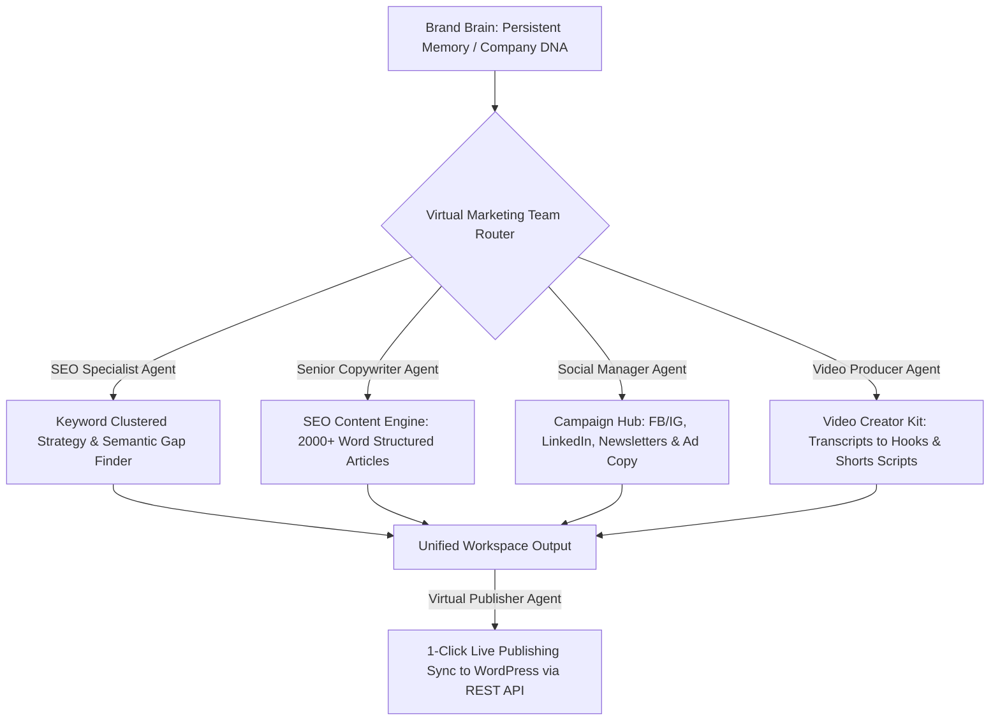

# Project Proposal: GrowthPilot AI
## Your Virtual AI Marketing Team & Automation Workspace for F-Commerce, SMEs, B2B, and B2C

**Course:** CSE 499 / Capstone Project / Thesis Project (Update as needed)  
**Project Track:** Full-Stack Web Application / Artificial Intelligence & SaaS Automation  
**Author / Student:** Najmol Hasan  
**Academic Supervisor:** [Insert Supervisor's Name]  

---

## 1. Project Abstract & Executive Summary

In today’s digital-first market, businesses of all sizes—ranging from Facebook Commerce (F-Commerce) startups and Small & Medium Enterprises (SMEs) to Business-to-Consumer (B2C) brands and Business-to-Business (B2B) firms—face an ongoing struggle to maintain an active, high-quality, and multi-channel marketing presence. Modern marketing demands constant social media engagement, search engine optimization (SEO), video content repurposing, and campaign coordination. For smaller businesses, hiring a dedicated marketing team is financially out of reach, while larger businesses struggle with fragmented software tools and inconsistent brand messaging from generic AI models.

**GrowthPilot AI** solves this by acting as an **Autonomous, Unified AI Marketing Team and Automation Hub**. Rather than operating as a basic text generator, the platform introduces a core innovation: the **"Brand Brain"**—a persistent memory snapshot that records a company's target market, product details, unique selling propositions (USPs), tone of voice, and language preferences. 

This proposal presents a full-stack, enterprise-grade Next.js 15 and Supabase platform that simulates the roles of a **virtual SEO Specialist, Copywriter, Social Media Manager, Video Producer, and Web Publisher**. GrowthPilot AI enables businesses to plan, write, audit, localized (in Bangla & English), and publish content directly to their channels—saving thousands of hours and offering professional-grade marketing automation to budget-constrained businesses.

---

## 2. Business Perspective: Problem & Need Analysis

Each business segment has distinct marketing paint points that GrowthPilot AI is built to solve:

```
┌────────────────────────────────────────────────────────────────────────┐
│                        BUSINESS SECTOR PAIN POINTS                     │
├───────────────────┬───────────────────┬────────────────┬───────────────┤
│    F-COMMERCE     │       SMEs        │      B2C       │      B2B      │
├───────────────────┼───────────────────┼────────────────┼───────────────┤
│ • Social fatigue  │ • Zero SEO budget │ • Multi-channel│ • High writer │
│ • Localized copy  │ • Small team size │   demand       │   cost        │
│   (Banglish/Bang) │ • Resource        │ • Video-first  │ • Complex     │
│ • Low conversion  │   scarcity        │   repurposing  │   tech topics │
└───────────────────┴───────────────────┴────────────────┴───────────────┘
```

### 2.1. F-Commerce (Facebook & Social Commerce)
*   **The Problem:** F-Commerce businesses depend heavily on organic traffic, product posts, and paid Facebook/Instagram ads. They face content fatigue—needing to post 2-3 times daily to keep up with algorithms. Furthermore, writing in natural "Banglish" (Bangla in English script) or localized Bangla that connects with regional shoppers is difficult to scale.
*   **The Need:** An instant, localized copywriter that understands products and generates high-converting Facebook post captions, ad copies, and interactive engagement hooks in seconds.

### 2.2. SMEs (Small and Medium Enterprises)
*   **The Problem:** SMEs operate with very tight budgets. They cannot afford to pay $500–$2,000/month for marketing agencies or hire dedicated SEO and content teams. They also lack the technical know-how to perform keyword clustering, semantic optimization, and technical SEO audits.
*   **The Need:** A cost-effective, all-in-one marketing assistant that handles SEO, copywriting, and analytics without requiring technical SEO experience.

### 2.3. B2C (Business-to-Consumer Brands)
*   **The Problem:** B2C businesses need to reach consumers across multiple platforms (blogs, emails, YouTube, TikTok, Reels, Facebook). Repurposing one long YouTube review or podcast into multiple blog posts, newsletters, and TikTok scripts takes days of manual work.
*   **The Need:** A multi-channel content repurposing pipeline that takes a single source (like a video transcript) and transforms it into 10+ distinct promotional assets.

### 2.4. B2B (Business-to-Business)
*   **The Problem:** B2B marketing requires deep industry authority, professional tone, and absolute consistency. Generic AI tools lack company-specific details, leading to inaccurate descriptions of complex SaaS or enterprise solutions.
*   **The Need:** A centralized brand memory repository that ensures all B2B assets—such as case studies, LinkedIn thought-leadership posts, and cold outreach emails—strictly adhere to corporate standards and product accuracy.

---

## 3. The Solution: How the "Virtual AI Marketing Team" Works

GrowthPilot AI models a real-world digital marketing agency, assigning specialized roles to autonomous AI agents:



1.  **Brand Brain (The Chief Marketing Officer - CMO):** Captures the business "DNA" (product USPs, target customer persona, brand rules, and tone). All other agents reference this central brain, ensuring that every output sounds like it was written by an in-house team member.
2.  **The SEO Specialist Agent:** Conducts semantic search analysis, uncovers industry trends, and groups keywords into thematic clusters.
3.  **The Senior Copywriter Agent:** Generates long-form, outline-structured articles complete with internal links, FAQs, and Google-friendly semantic optimizations.
4.  **The Social Media Manager Agent:** Automatically produces multi-platform social media posts (Facebook, Instagram, LinkedIn), ad copy variations, and email campaigns from a single product detail page.
5.  **The Video Producer Agent:** Accepts video transcripts or links and outputs short-form video hooks, video chapters, descriptions, and TikTok/Reels scripts.
6.  **The Web Publisher Agent:** Connects directly to CMS platforms like WordPress via REST APIs to draft, optimize, tag, and publish generated articles in one click.

---

## 4. Key Platform Workflows & Modules

*   **Brand Brain Memory Dashboard:** A structured editor where businesses define their profile. F-commerce sellers can specify local pricing, delivery rules, and local tone guidelines.
*   **Bilingual Campaign Planner (Bangla & English):** Specially optimized for Bangladesh and regional South Asian markets, this module allows users to generate ad copies and captions in English, standard Bangla, or natural conversational Banglish.
*   **Video Repurposing Engine (Video Creator Kit v2):** Designed for B2C brands and creators. Users input a YouTube link or paste an audio transcript; the engine extracts key quotes, structures video chapters, and outputs scripts for short-form clips.
*   **Omnichannel Launch Kit:** Creates a comprehensive marketing package for product releases (press releases, product descriptions, email announcements, launch checklists, and ad variants).
*   **WordPress API Connector:** Fully automated article synchronization, pushing drafted content along with SEO meta tags directly to the live website.
*   **Restricted Super Admin Control Center ([gp-admin](file:///C:/Users/NAJMOL%20HASAN/Desktop/SEO%20Automation/src/app/gp-admin/page.tsx)):** Provides centralized platform management. Admins can monitor system health, check usage logs, edit user accounts, and dynamically update monthly trial limits (writing caps, keyword search limits, marketing runs) that sync instantly to the database.

---

## 5. Technical Implementation & Architecture

### 5.1. Tech Stack
*   **Frontend:** Next.js 15 (App Router, TypeScript, Tailwind CSS, Framer Motion for high-fidelity animations and dark-mode workspace).
*   **Backend & DB:** Supabase (PostgreSQL with Row Level Security (RLS) policies protecting user data).
*   **AI Orchestration:** Gemini Pro API / GPT API integrated using context-injection prompting techniques.
*   **Integrations:** WordPress REST API for automated publishing.

### 5.2. Database Schema Design
The backend relies on structured PostgreSQL tables. Users are isolated using Supabase's native authentication and Row Level Security (RLS).

#### 1. Brand Profiles Table (`brand_profiles`)
Stores the unified business profile context.
```sql
create table if not exists public.brand_profiles (
  user_id uuid primary key references auth.users(id) on delete cascade,
  profile jsonb not null default '{}'::jsonb,
  updated_at timestamptz not null default now()
);
```
*   *Security Policy:* `auth.uid() = user_id` (Users can only modify their own brand profile).

#### 2. Marketing Assets Table (`marketing_assets`)
Stores user-generated assets (SEO drafts, videos, campaigns).
```sql
create table if not exists public.marketing_assets (
  id uuid primary key default gen_random_uuid(),
  user_id uuid not null references auth.users(id) on delete cascade,
  tool text not null,
  title text not null default 'Untitled asset',
  language text not null default 'English',
  inputs jsonb not null default '{}'::jsonb,
  brand_snapshot jsonb not null default '{}'::jsonb,
  result jsonb not null default '{}'::jsonb,
  created_at timestamptz not null default now()
);
```
*   *Security Policy:* `auth.uid() = user_id` (Users can only access their own assets). An index on `(user_id, created_at desc)` optimizes data loading.

#### 3. System Configuration Table (`system_config`)
Controls the global system settings managed via the admin panel.
```sql
create table if not exists public.system_config (
  key text primary key,
  value text not null,
  updated_at timestamptz not null default now()
);
```
*   *Security:* Public read enabled (so frontend can check limits). Write accesses are strictly restricted to the service role (bypassing RLS), which is only used in the secure server environment of the admin dashboard.

---

## 6. Business Value, Team Time-Saving & ROI Analysis

GrowthPilot AI acts as a major productivity booster for small and medium-sized marketing teams.

### 6.1. Time-Saving Analysis (Traditional vs. GrowthPilot AI)
For a typical SME or F-commerce business producing a weekly marketing package (1 SEO blog, 5 Facebook posts, 3 TikTok/Reels scripts, 1 newsletter, and 1 product listing):

*   **Traditional Process Time Breakdown:**
    *   Keyword Research & Competitor Audit: **2 hours**
    *   Drafting & Formatting SEO Blog Post: **5 hours**
    *   Social Media Caption & Graphics Copywriting (Bangla/English): **3 hours**
    *   Video Script Writing (Extracting from long product videos): **3 hours**
    *   Drafting Newsletter & Email Campaign: **2 hours**
    *   Copying, Formatting, and Publishing to WordPress & Pages: **1 hour**
    *   **Total Weekly Time Spent: 16 Hours**

*   **GrowthPilot AI Process Time Breakdown:**
    *   Brand Brain context injection: **Instant (0 mins)**
    *   Keyword Clustered Ideas: **2 mins**
    *   SEO Article Generation & On-page Audit: **5 mins**
    *   Campaign Copy & Localized Social Captions: **3 mins**
    *   Video Creator Kit (transcribing & script formatting): **3 mins**
    *   1-Click WordPress Auto-Publish: **Instant (1 min)**
    *   Human Review, Tweaking, & Verification: **60 mins**
    *   **Total Weekly Time Spent: ~1 Hour & 14 Mins**

> [!IMPORTANT]
> **Weekly Time Saved:** **14 Hours and 46 Minutes (92% Time Reduction)**.  
   This allows a small business owner or a single marketing coordinator to do the work of a 5-person agency in under 2 hours a week.

### 6.2. Business ROI Comparison

| Metric | Hiring an In-House Marketing Team | Hiring a Digital Agency | Using GrowthPilot AI Workspace |
| :--- | :--- | :--- | :--- |
| **Monthly Cost** | ৳1,20,000+ ($1,000+ / mo) | ৳50,000+ ($400+ / mo) | **৳5,000 - ৳10,000 ($49 - $99 / mo)** |
| **Output Speed** | 2-3 Days per Campaign | 3-5 Days per Campaign | **Under 15 Minutes** |
| **Brand Consistency**| High (but human error-prone) | Variable (agency changes writers) | **Absolute (Locked in Brand Brain)** |
| **Multi-channel Sync**| Manual posting | Manual scheduled posts | **1-Click Automated REST Publishing** |

---

## 7. Future Opportunities & Growth Roadmap

GrowthPilot AI is designed to adapt to emerging marketing technologies:
1.  **Autonomous Social Media Publishing (Meta API Integration):** Directly publishing scheduled posts, stories, and ad campaigns to Facebook Pages and Instagram accounts.
2.  **AI Graphics & Image Generation:** Integrating tools like Stable Diffusion or Midjourney to automatically generate on-brand social media templates based on the Brand Brain's guidelines.
3.  **Conversational F-Commerce Chatbot Sync:** Syncing the Brand Brain directly with Facebook Messenger and WhatsApp Business APIs to handle customer queries and product questions using consistent brand information.
4.  **AI competitor auditing:** Scanning competitor websites and importing search gaps directly into the Keyword & Trend workspace.

---

## 8. Conclusion & Academic Merits

### Academic Innovation
*   **Prompt Pipeline Design:** Demonstrates advanced context assembly, feeding multi-layered JSON metadata (the Brand Brain profile) to LLM engines to create consistent, structured content.
*   **Robust Access Controls:** Combines public user Row Level Security (RLS) with server-side admin controls to showcase a secure, multi-tenant web application.
*   **Cross-System API Automation:** Showcases full-stack engineering through the REST API integration with external WordPress platforms, executing automated content formatting, tag generation, and publishing pipelines.

### Commercial Potential
GrowthPilot AI addresses real-world marketing challenges faced by F-Commerce sellers, SMEs, B2B, and B2C brands. By automating repetitive copywriting, keyword research, video repurposing, and content publishing workflows, it lowers the barrier to entry for digital marketing, making it an exceptional Capstone Project.
